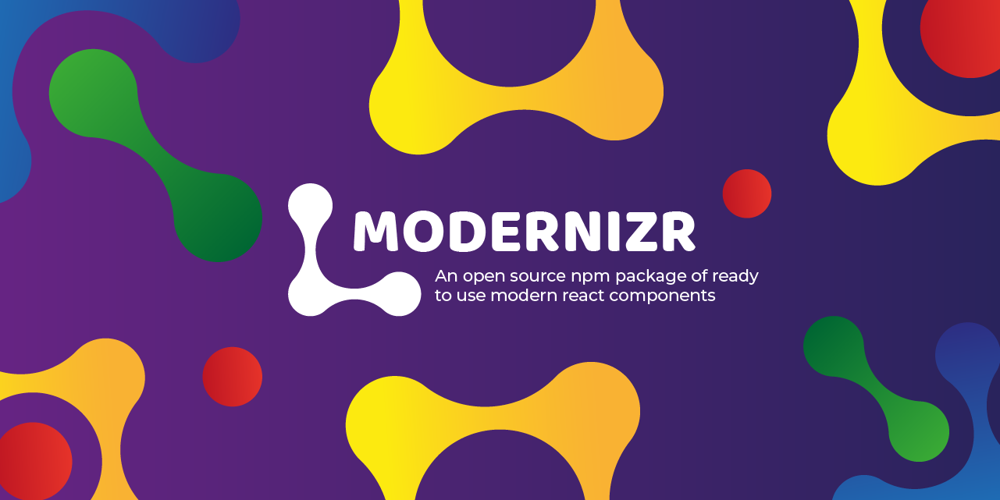

# The modernizr project

## What is about?

The idea of this project is develop a modern kit of components for react and publish it to npm as a package.

The components has a good ux, and its responsive, in such a way that it looks good on any device and that the user likes to browse the web where the components are used.

Also, it has a good style `sass` system. It takes care of the branding and design system for the web where the components are used.

## What is the use of this project?

You can take use of the components, installing the package and use it in your web project.

## Who and how you can take use of it?

As I said before, is an npm package so you can use it installing in your project.

### LICENSE

This project is licensed under the [ISC license](https://github.com/nilis24/custom-components/blob/master/LICENSE), so you can use it taking into account the permissions of the license.

## How you can contribute

If you want to contribute, read [CONTRIBUTING.md](CONTRIBUTING.md) and follow the rules explained in the file.

## Who maintains and contributes to this project?

Everyone can maintain and contribute to this project.

And in the event that you find a bug, vulnerability or something to improve, please open an issue using the bug / feature request template and explain the problem or the idea there
