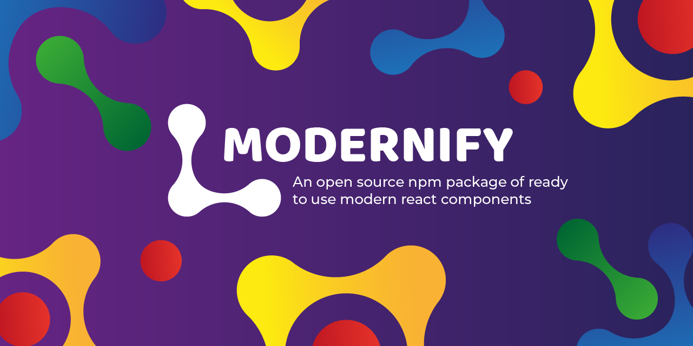

# The modernify project

[](https://www.npmjs.com/package/modernify) [](https://standardjs.com)

## What is about?

The idea of this project is develop a modern kit of components for react and publish it as a npm package.

The components should has a good ux, and should be responsive, in such a way that it looks good on any device and that the user likes to browse the web where the components are used.

## What is the use of this project and why is it useful?

You can take use of the components, installing the package and use it in your web project. It's useful because you can put modern style in your project without having knowledge of CSS.  

## About the license

This project is licensed under the [ISC license](https://github.com/nilis24/custom-components/blob/master/LICENSE), so everyone can use it taking into account the permissions of the license.

ISC © [nilis24](https://github.com/nilis24)

## How you can contribute and how you can begin to contribute

If you want to contribute, read [CONTRIBUTING.md](CONTRIBUTING.md) and follow the rules explained in the file. **You can join to our discord server: [click here](https://discord.gg/WGYWjhdwNV)**. Start reading the [CONTRIBUTING.md](CONTRIBUTING.md) to begin.

## Who maintains and contributes to this project?

Everyone contribute to this project, also everyone can find bugs and report it. But only the owner can maintain the project.

## Install

```bash
npm install --save modernify
```

## Usage

```tsx
import React, { Component } from 'react'

import MyComponent from 'modernify'
import 'modernify/dist/index.css'

class Example extends Component {
  render() {
    return <MyComponent />
  }
}
```
